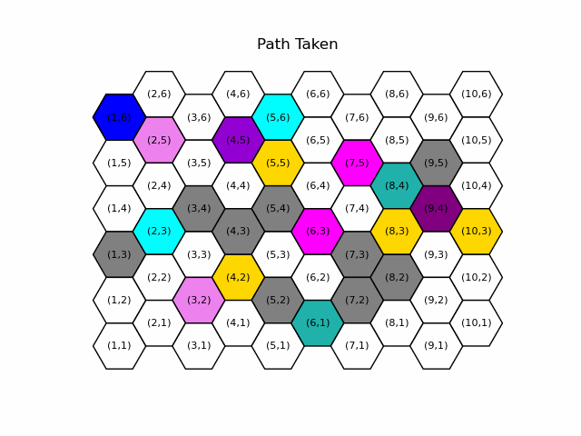

# Overview
This project implements an A* pathfinding algorithm on a hexagonal grid with special cells such as traps, rewards, obstacles, and treasures. The algorithm prioritizes collecting treasures based on proximity and dynamically adjusts exploration paths. The hexagonal grid and path are visualized using Matplotlib.

# Features
- Hexagonal Grid Navigation: Navigate through a grid with hexagonal cells.
- A Algorithm*: Find the shortest path to collect all treasures.
- Special Cells: Handle traps and rewards that affect movement costs.
- Dynamic Path Adjustment: Adjust paths based on the effects of traps and rewards.
- Visualization: Visualize the grid and the path taken using Matplotlib animations.

# Prerequisites
Ensure you have Python installed on your system. This project requires the following Python packages:
1. matplotlib
2. numpy

You can install the necessary packages using pip:
```
pip install matplotlib numpy
```
# Usage
1. Clone the repository:
```
git clone <repository-url>
cd <repository-directory>
```
2. Run the Script:  
```
python A_Star_Algorithm
```

**Note:** The visualization of the algorithm may not work as intended for some users, hence a file called path_animation.gif will be generated in the same _directory_ where the script is located which shows how the algorithm runs. 



